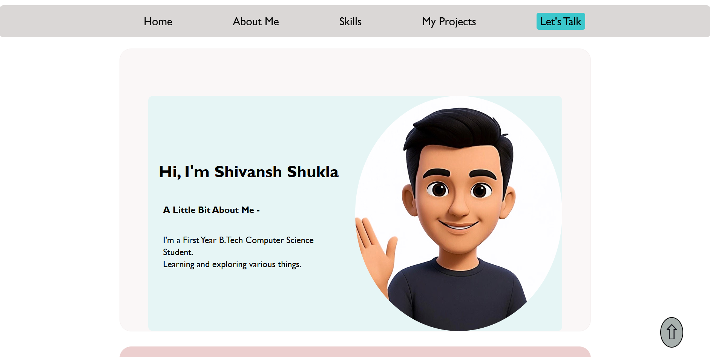

# Shivansh Shukla - Portfolio
My personal portfolio website built with pure HTML5 and CSS3.

## About 
- I'm a First-year B.Tech Computer Science student.
- This is my First major project where I applied everything I learned about HTML and CSS until now.

## Features 
- Fully responsive design (mobile-friendly)
- Clean and modern UI
- Multi-section layout (Hero, About, Skills, Project, Contact)
- Smooth navigation
- Back to top button
- About me
- My projects
- Contact form

## Technologies Used 
- HTML5 (Semantic markup)
- CSS3 (Flexbox, Grid, Responsive design)
- Font Awesome icons

## What I learned
- Proper semantic HTML structure
- CSS Flexbox and Grid for layouts
- Responsive design (mobile-first)
- Organizing code and deploying a website
- Writing clean code

## Live Demo - 
[View Live Site](https://shivanshshukla-portfolio.netlify.app/)

## Preview - 

